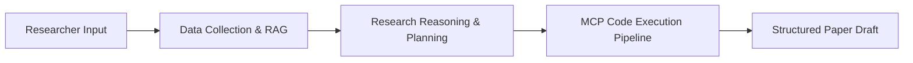

# Research Copilot 🚀

> **An Autonomous AI Research Engineering Platform**

Research Copilot is an AI-powered platform designed to assist researchers throughout the complete scientific research lifecycle—from discovering literature and identifying research gaps to executing experiments, reproducing published methods, and writing publication-ready manuscripts.

Unlike traditional chatbots or search engines that only summarize paper text, Research Copilot functions as an **AI Research Engineer** capable of executing reproducible code experiments, modifying model architectures, comparing baseline results, and preserving strict citation integrity.

 

---

## 🏛️ System Lifecycle Overview

 

### High-Level Execution Pipeline

 

---

## 🎯 Key Capabilities

* **Multi-Source Aggregation**: Automated metadata & artifact retrieval across 8 scientific repositories (arXiv, Papers with Code, Hugging Face, Kaggle, OpenAlex, Semantic Scholar, Crossref, PubMed).
* **Agentic RAG & Knowledge Graph**: Relational subgraphs connecting papers, code repositories, benchmarks, datasets, and authors with hybrid search & re-ranking.
* **Autonomous Experiment Execution**: Routing execution directives via MCP to coding agents (Claude Code, OpenAI Codex, OpenCode) for training, hyperparameter search, and evaluation.
* **Publication-Ready Paper Drafting**: Synthesis of empirical evidence into 8 structured LaTeX paper sections with verified citation attribution.

 

---

## 📚 Documentation Index

The full system documentation is organized cleanly in the [`docs/`](./docs) directory:

* 🏛️ **[System Architecture](./docs/architecture.md)** — Comprehensive technical spec, 10 modular services, RAG design, and MCP router.
* 🔄 **[Research Workflow](./docs/workflow.md)** — The 12-stage research engineering process from topic definition to manuscript publication.
* 🗺️ **[Development Roadmap](./docs/roadmap.md)** — Implementation phases and milestone checklists for building the platform.
* 🤖 **[AI Agent Guidelines](./AGENTS.md)** — Operational constraints, design principles, and guidelines for AI agents working in this repository.

 

---

## ⚡ Quick Start

Phase 1 (arXiv Ingestion & Data Models) is currently under active implementation. Refer to the [Development Roadmap](./docs/roadmap.md) for progress updates.
