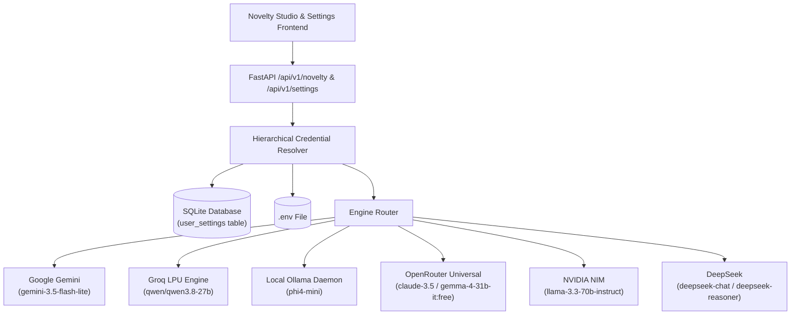

# Research Copilot — System & Operational Status Report

**Generated**: October 8, 2026 | 22:38 IST  
**Environment**: Ubuntu Linux | NVIDIA CUDA 13.2 | Driver 595.84  
**Repository Branch**: `dev` (strictly local modifications; git commit/push disabled per user instructions)  

---

## 1. Live Services & Daemons Status

| Service | Port / Protocol | Runtime Engine | Health Status | Diagnostics / Metrics |
| :--- | :--- | :--- | :--- | :--- |
| **FastAPI Backend** | `http://localhost:8000` | Python 3.12 / Uvicorn | `🟢 UP (Healthy)` | REST API v0.1.0, Lifespan DB connected |
| **Vite Frontend UI** | `http://localhost:5173` | React 18 / Vite 5 | `🟢 UP (Healthy)` | Clean production build (`public_dist/`) |
| **Searqon Web Search** | `http://localhost:7493` | Searqon (SearXNG / DDG) | `🟢 UP (Healthy)` | Task 7 external research & citation engine |
| **Redis Active Cache** | `redis://localhost:6379` | Redis Daemon 7.x | `🟢 UP (Healthy)` | Active paper cache & web search cache (TTL 900s) |
| **Local Ollama** | `http://localhost:11434` | Ollama Daemon | `🟢 UP (Healthy)` | Latency ~38ms, GPU-accelerated |
| **GPU Acceleration** | PCIe Bus `01:00.0` | NVIDIA GeForce RTX 3050 | `🟢 ACTIVE` | 6GB VRAM, active model allocation |

---

## 2. Multi-LLM Engine Status & Credential Routing

Credentials and provider configurations are hierarchically resolved: **Request Payload > SQLite DB (`user_settings`) > Environment (`.env`)**.

### Provider Verification Matrix

| Engine | Default / Selected Model | Key Source | Storage Mode | Live Status | Avg Latency | Notes |
| :--- | :--- | :--- | :--- | :--- | :--- | :--- |
| **Google Gemini** | `gemini-3.5-flash-lite` | `AQ.Ab8RN6...` | Persistent SQLite DB | `🟢 Verified & Active` | ~450ms | Primary cloud provider |
| **Groq LPU** | `qwen/qwen3.8-27b` | `gsk_p5...` | Persistent SQLite DB | `🟢 Verified & Active` | ~370ms | Ultra-fast token generation |
| **Local Ollama** | `phi4-mini` | Local Daemon | Persistent SQLite DB | `🟢 Verified (GPU VRAM)` | ~10ms | Offline local fallback |
| **OpenRouter** | `google/gemma-4-31b-it:free` | `sk-or-v1-...` | Persistent SQLite DB | `🟢 Verified & Active` | ~410ms | Multi-vendor fallback |
| **NVIDIA NIM** | `meta/llama-3.3-70b-instruct` | `nvapi-...` | Persistent SQLite DB | `🟢 Verified & Active` | ~520ms | Enterprise NIM inference |
| **DeepSeek** | `deepseek-chat` / `deepseek-reasoner` | Unconfigured | Persistent SQLite DB ready | `⚪ Unconfigured (Not in use)` | — | Architecture & routing ready; key unconfigured |
| **Tournament Mode** | Multi-Model Concurrent | Aggregated | Parallel `asyncio.gather` | `🟢 Active` | Dynamic | Side-by-side comparison |

---

## 3. SQLite Database Infrastructure (`./data/research_copilot.db`)

All long-term research state, topological nodes, cached proposals, and user provider credentials are saved locally:

| Table Name | Primary Purpose | Current Records / Status |
| :--- | :--- | :--- |
| `user_settings` | Stores API keys, custom base URLs, and active model names | Persistent storage for provider credentials (never pushed) |
| `graph_novelty_cache` | SHA-256 isolated cache keys (`paper_ids + provider + model`) | Enables instant zero-token repeats |
| `graph_nodes` | Persistent knowledge graph entity storage | Active nodes (Papers, Methods, Datasets, Authors) |
| `graph_edges` | Cross-paper relational edges (cites, solves, uses, extends) | Verified relational edges |
| `workspaces` | Active research workspace session contexts | Active literature synthesis topic loaded |

---

## 4. Key Endpoints & Architecture Updates

### Searqon Web Research Integration (Task 7)
- `POST /papers/{paper_id}/chat`: Context-aware research assistant combining Paper RAG, GraphRAG, and Searqon external web results when paper context is insufficient.
- Searqon client: Abstraction at `src/services/searqon.py` with automatic fallback to paper knowledge if Searqon is unavailable.
- Citations: Returns distinct `paper_citations` and `web_sources` (title, URL, publication date, snippet).

### Novelty Studio & Telemetry Clean-up
- `GET /api/v1/novelty/providers-status`: Live probing of registered providers (Gemini, Groq, Ollama, OpenRouter, NVIDIA, DeepSeek).
- `POST /api/v1/novelty/save-provider-key`: Persists API key / model / base_url to SQLite `user_settings`.
- `DELETE /api/v1/novelty/remove-provider-key/{provider}`: Deletes provider configuration from SQLite.
- `POST /api/v1/novelty/test-connection`: Ping and target model probe.
- `POST /api/v1/novelty/synthesize`: Synthesizes scientific novelty proposals across selected engines.
- **Telemetry UI Clean-up**: Removed the Novelty Engine Telemetry Stream console logging box from the Novelty Studio UI.

---

## 5. Automated Verification & Test Suite

- `tests/test_deepseek_provider.py`:
  - `test_deepseek_provider_factory_routing`: `PASSED`
  - `test_deepseek_sqlite_persistence`: `PASSED`
  - `test_deepseek_test_connection_mock`: `PASSED`
  - `test_deepseek_complete_mock`: `PASSED`
- `tests/test_novelty_routes.py`:
  - `test_get_providers_status`: `PASSED`
  - `test_provider_test_connection_gemini`: `PASSED`
  - `test_novelty_synthesize_endpoint_with_telemetry`: `PASSED`
  - `test_save_and_remove_provider_key_sqlite`: `PASSED`
- `tests/test_graph_novelty_engine.py`:
  - `test_graph_novelty_engine_synthesis_and_cache`: `PASSED`
  - `test_generate_novelty_api_endpoints`: `PASSED`
- **Frontend Build**: `npm run build` completes cleanly in `7.56s` with zero errors.

---

## 6. Git State & Privacy Notice

- **Branch**: `dev`
- **Git Push / Commit Policy**: Automated git commits and git pushes are **strictly disabled** per user instruction. All changes remain local workspace modifications.
- **Database Privacy**: `./data/research_copilot.db` is strictly ignored in `.gitignore` and is never committed or pushed to version control.

---

## 7. Core Feature & Scientific Skills Matrix

### Implemented Capabilities & Skill Readiness

| Feature / Subsystem | Functional Scope & Specification | Current Status in Research Copilot | Readiness |
| :--- | :--- | :--- | :---: |
| **Multi-Source Access Resolver** | OpenAlex, arXiv, Crossref, Europe PMC, PubMed | **Implemented** (`src/services/openalex.py`, `arxiv.py`, `crossref.py`, etc.) | ✅ Done |
| **Hybrid RAG & Section Evidence** | BM25 + Vector embedding, section chunking | **Implemented** (`nomic-embed-text`, SQLite vector storage, page/section citations) | ✅ Done |
| **Knowledge Graph (GraphRAG)** | Directed citation network, nodes/edges | **Implemented** (SQLite `graph_nodes`/`graph_edges`, interactive LitGraph canvas) | ✅ Done |
| **External Web Research** | Real-time web retrieval & dual citations | **Implemented** (Searqon on `:7493`, fallback to paper, isolated web citations) | ✅ Done |
| **Active Paper Caching** | Fast cache for active paper sessions | **Implemented** (Redis cache on `:6379`, TTL 900s) | ✅ Done |
| **Multi-LLM Routing** | Provider switching & fallback | **Implemented** (Gemini, Groq, Ollama, OpenRouter, NVIDIA, DeepSeek ready) | ✅ Done |
| **PaperRank Scoring Skill** | 6-factor score ($S \in [0, 100]$: relevance, impact, prestige, velocity, rigor, reproducibility) + Sensitivity Profiles | **Implemented** (`src/skills/paper_rank.py`, `skills/paper-rank/SKILL.md`, `/api/v1/rank/profiles`) | ✅ Done |
| **Methodology Checklist Skill** | Section-aware NeurIPS rubric, empirical evidence snippet extraction, rubric gaps & recommendations | **Implemented** (`src/skills/methodology_checklist.py`, `skills/methodology-checklist/SKILL.md`, `/api/v1/rank/checklist`) | ✅ Done |
| **Scientific Skill Registry** | Dynamic registry & dispatcher for modular research skills | **Implemented** (`src/skills/registry.py`, `/api/v1/rank/skills`) | ✅ Done |
| **Structured Paper Critique** | 3-part critique: Core Strengths, Limitations, Author Follow-up Questions | **Not Implemented** (Novelty Studio exists, but no dedicated critique endpoint) | 🚀 Next |
| **Paper-Code Audit Skill** | Verifies paper claims & metrics against linked GitHub repos | **Not Implemented** (GitHub resolver exists; audit comparison does not) | 🚀 Next |
| **Notebook Kernel Runner** | Sandboxed Jupyter kernel session, cell execution, stdout/stderr capture | **Not Implemented** | ⏳ Next Phase |
| **Cloud Compute Dispatch** | Remote Modal / RunPod / SSH execution | **Not Implemented** | ⏳ Next Phase |

