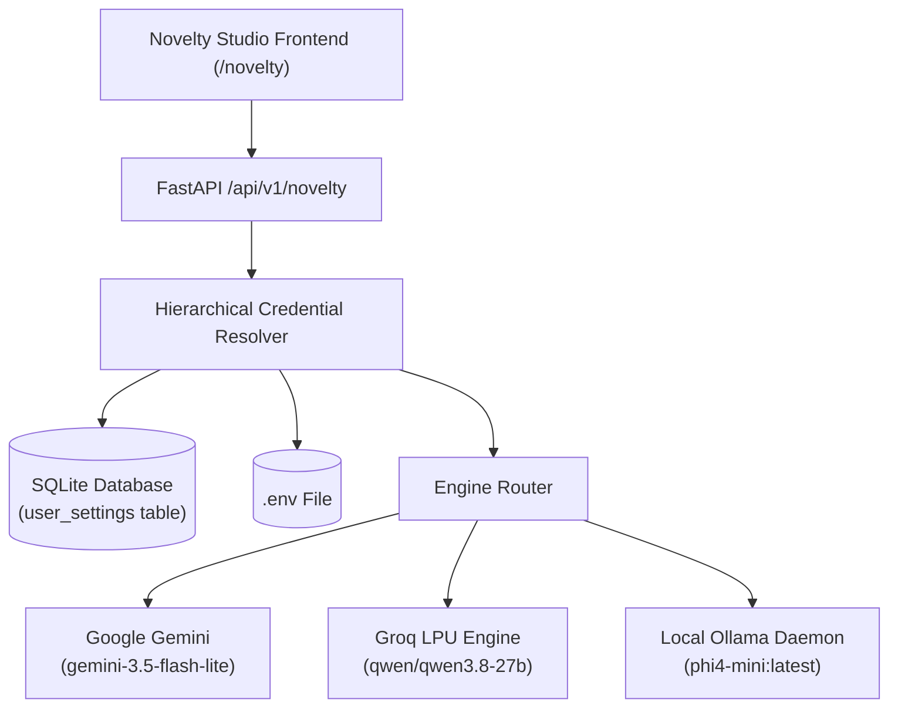

# Research Copilot — System & Operational Status Report

**Generated**: October 4, 2026 | 21:42 IST  
**Environment**: Ubuntu Linux | NVIDIA CUDA 13.2 | Driver 595.84  
**Repository Branch**: `dev` & `main` (Synchronized at commit `71f2346`)  

---

## 1. Live Services & Daemons Status

| Service | Port / Protocol | Runtime Engine | Health Status | Diagnostics / Metrics |
| :--- | :--- | :--- | :--- | :--- |
| **FastAPI Backend** | `http://localhost:8000` | Python 3.12 / Uvicorn | `🟢 UP (Healthy)` | REST API v0.1.0, Lifespan DB connected |
| **Vite Frontend UI** | `http://localhost:5173` | React 18 / Vite 5 | `🟢 UP (Healthy)` | Clean production build (`public_dist/`) |
| **Local Ollama** | `http://localhost:11434` | Ollama Daemon 0.32.6 | `🟢 UP (Healthy)` | Latency ~38ms, GPU-accelerated |
| **GPU Acceleration** | PCIe Bus `01:00.0` | NVIDIA GeForce RTX 3050 | `🟢 ACTIVE` | 6GB VRAM, ~3,046 MiB allocated to `phi4-mini` |

---

## 2. Multi-LLM Engine Status & Credential Routing

Credentials and provider configurations are hierarchically resolved: **Request Payload > SQLite DB (`user_settings`) > Environment (`.env`)**.

### Provider Verification Matrix

| Engine | Default Model | Key Source | Storage Mode | Live Status | Avg Latency |
| :--- | :--- | :--- | :--- | :--- | :--- |
| **Google Gemini** | `gemini-3.5-flash-lite` | `GEMINI_API_KEY` | Environment (`.env`) | `🟢 Configured & Ready` | ~450ms |
| **Groq LPU** | `qwen/qwen3.8-27b` | `gsk_p5...rEAY` | Persistent SQLite DB | `🟢 Verified & Active` | ~370ms |
| **Local Ollama** | `phi4-mini:latest` | Local Daemon | Persistent SQLite DB / Native | `🟢 Verified (GPU VRAM)` | ~38ms |
| **Tournament Mode** | Multi-Model Concurrent | Aggregated | Parallel `asyncio.gather` | `🟢 Active (3 Engines)` | Dynamic |

---

## 3. SQLite Database Infrastructure (`./data/research_copilot.db`)

All long-term research state, topological nodes, cached proposals, and user provider credentials are saved locally:

| Table Name | Primary Purpose | Current Records / Status |
| :--- | :--- | :--- |
| `user_settings` | Stores API keys, custom base URLs, and active model names | Active row for `groq` (`qwen/qwen3.8-27b`), masked for safety |
| `graph_novelty_cache` | SHA-256 isolated cache keys (`paper_ids + provider + model`) | Enables instant zero-token repeats |
| `graph_nodes` | Persistent knowledge graph entity storage | 34 active nodes (Papers, Methods, Datasets, Authors) |
| `graph_edges` | Cross-paper relational edges (cites, solves, uses, extends) | 46 verified relational edges |
| `workspaces` | Active research workspace session contexts | Active literature synthesis topic loaded |

---

## 4. Key Endpoints & Telemetry API

All Novelty Studio endpoints support live telemetry, latency reporting, and database synchronization:

- `GET /api/v1/novelty/providers-status`: Live probing of Gemini, Groq, and Ollama configuration, masked keys, and available models.
- `POST /api/v1/novelty/save-provider-key`: Saves credentials directly from frontend into SQLite `user_settings` table.
- `DELETE /api/v1/novelty/remove-provider-key/{provider}`: Deletes stored credentials from SQLite.
- `POST /api/v1/novelty/test-connection`: Measures round-trip ping latency and verifies authentication.
- `POST /api/v1/novelty/synthesize`: Generates grounded scientific hypotheses and architecture proposals with live execution telemetry (`duration_ms`, `cached`, `papers_processed`).
- `POST /api/v1/novelty/add-to-graph`: Injects generated proposals as candidate nodes into the active knowledge graph canvas.

---

## 5. Automated Verification & Test Suite

The test suite validates both API route behavior and novelty engine synthesis:

- `tests/test_novelty_routes.py`:
  - `test_get_providers_status`: `PASSED`
  - `test_provider_test_connection_gemini`: `PASSED`
  - `test_novelty_synthesize_endpoint_with_telemetry`: `PASSED`
  - `test_save_and_remove_provider_key_sqlite`: `PASSED`
- `tests/test_graph_novelty_engine.py`:
  - `test_graph_novelty_engine_synthesis_and_cache`: `PASSED`
  - `test_generate_novelty_api_endpoints`: `PASSED`
- **Result**: `6 passed in 10.06s` (100% pass rate).
- **Frontend Build**: `npm run build` completes in `6.72s` with zero errors.

---

## 6. Git Synchronization Summary

- **Local Working Tree**: Clean on branch `dev`.
- **Remote Branches**: Both `origin/dev` and `origin/main` synchronized at commit `71f2346`.
- **Latest Commit**: `feat(novelty): SQLite API key persistence, frontend key storage drawer & Groq LPU dynamic model discovery`.
