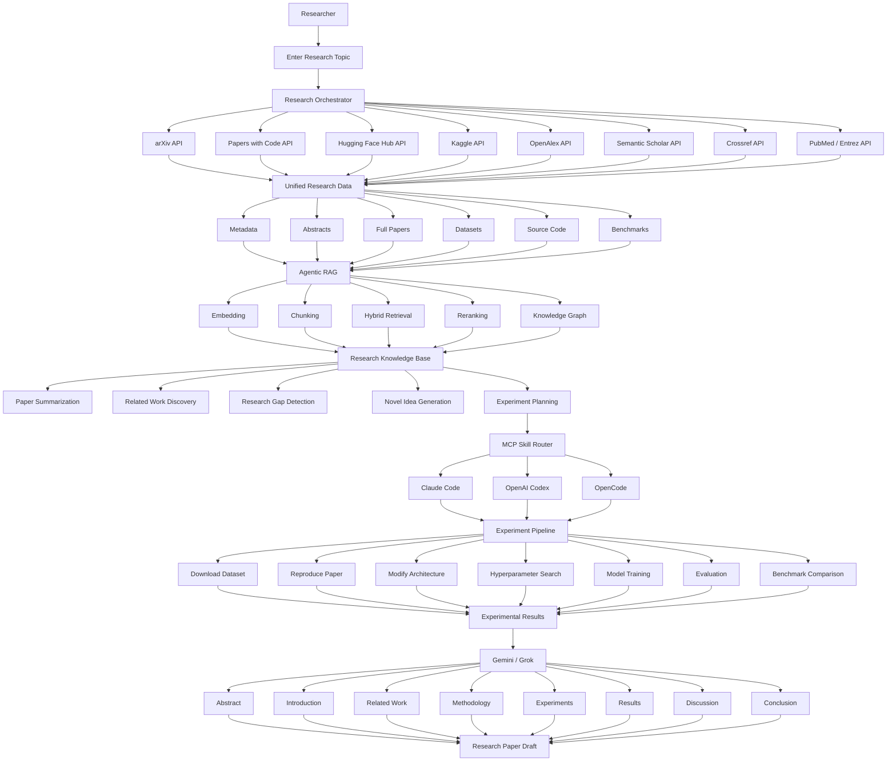

# System Architecture

Research Copilot follows a decoupled, modular 10-layer architecture. Every component has a single, well-defined responsibility, allowing data ingestion, retrieval, reasoning, code execution, and document generation to operate independently.

 

---

## 📊 Complete Architecture Flowchart

 

---

## 🏛️ Core Architectural Subsystems

### 1. Data Ingestion & Unification
The `Research Orchestrator` manages parallel calls to 8 primary scientific APIs:
* **arXiv API**: Retrieves paper preprints, LaTeX source bundles, and author data.
* **Papers with Code API**: Obtains leaderboard benchmarks, evaluation tables, and repository links.
* **Hugging Face Hub API**: Collects model weights, dataset metadata, and README cards.
* **Kaggle API**: Fetches competition datasets, code notebooks, and baseline scores.
* **OpenAlex API**: Maps global scholarly entities, citations, and institutional networks.
* **Semantic Scholar API**: Provides paper influence graphs and TLDR summaries.
* **Crossref API**: Accesses publisher metadata and DOI registration records.
* **PubMed / Entrez API**: Accesses life science literature and MeSH indexing.

All outputs are unified into structured data categories: *Metadata*, *Abstracts*, *Full Papers*, *Datasets*, *Source Code*, and *Benchmarks*.

 

### 2. Agentic RAG Engine
* **Embedding & Chunking**: Performs semantic section-aware chunking and multi-modal embedding generation.
* **Hybrid Retrieval**: Integrates sparse keyword matching (BM25) with dense semantic vector search.
* **Reranking**: Scores retrieved context based on scientific context relevance.
* **Knowledge Graph Construction**: Constructs subgraphs linking papers $\leftrightarrow$ authors $\leftrightarrow$ datasets $\leftrightarrow$ code repos $\leftrightarrow$ benchmarks.

 

### 3. Research Intelligence
Extracts actionable insights from the **Research Knowledge Base**:
* Paper Summarization
* Related Work Discovery
* Research Gap Detection
* Novel Idea Generation
* Experiment Planning

 

### 4. MCP Skill Router & AI Coding Agents
* **MCP Router**: Translates experiment plans into executable MCP tool invocations.
* **Agent Ecosystem**: Dispatches code execution tasks to specialized agents (**Claude Code**, **OpenAI Codex**, **OpenCode**).
* **Containerized Pipeline**:
  $$\text{Download Dataset} \rightarrow \text{Reproduce Paper} \rightarrow \text{Modify Architecture} \rightarrow \text{Hyperparameter Search} \rightarrow \text{Model Training} \rightarrow \text{Evaluation} \rightarrow \text{Benchmark Comparison}$$

 

### 5. Structured Paper Generation
* **Synthesis Engine (Gemini / Grok)**: Merges empirical results from code execution runs with retrieved background evidence.
* **8 Section Drafts**: Generates *Abstract, Introduction, Related Work, Methodology, Experiments, Results, Discussion, Conclusion*.
* **Output**: Assembles a fully referenced, publication-ready LaTeX research paper draft.
