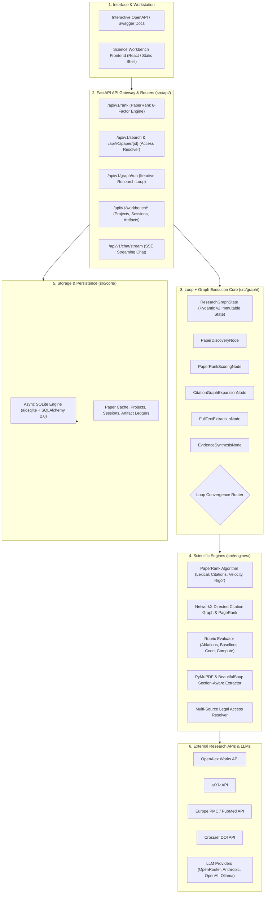

# Research Copilot — System Architecture

Research Copilot is an autonomous AI Research Engineering platform designed with a **Loop + Graph** execution core and a modular **Python + FastAPI** service architecture.

---

## 🏛️ High-Level System Architecture

---

## 🔑 Core Subsystems

### 1. Loop + Graph Research Engine (`src/graph/`)
- Built on a state-machine graph topology where nodes encapsulate distinct research operations.
- Conditional edge routing enables feedback loops (e.g. expanding citations, re-ranking, and retrieving full-text until convergence).
- Extensible architecture: Developers can plug custom nodes (e.g. Bio folding nodes, ML training recipe generators, code sandboxes) into the execution pipeline with standard contracts.

### 2. The PaperRank Algorithm (`src/engines/paper_rank.py`)
Multi-factor paper prioritization:
1. **Topical Relevance (30%)**: BM25 & n-gram lexical coverage.
2. **Citation Impact (20%)**: Normalized log-scaled citation volume.
3. **Graph Prestige (20%)**: PageRank over local directed citation graphs.
4. **Citation Velocity (10%)**: Annual publication momentum.
5. **Methodology Quality (10%)**: Automated detection of ablations, baselines, benchmarks, and uncertainty quantification.
6. **Reproducibility (10%)**: Automated detection of GitHub/GitLab repositories, dataset links, and compute budgets.

### 3. Legal Open-Access Resolver (`src/engines/access_resolver.py`)
- Resolves DOI, arXiv ID, OpenAlex ID, PMID, and PMCID to locate legal open-access PDF/HTML candidates.

### 4. Async SQLite Storage & Ledgers (`src/core/database.py`)
- Asynchronous SQLite database via `aiosqlite` and `SQLAlchemy 2.0`.
- Manages projects, sessions, artifact ledgers, and graph run snapshots.
