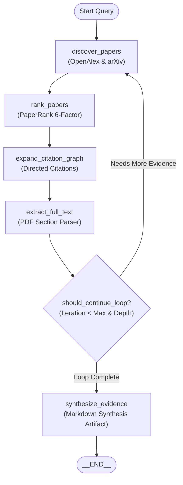

# Loop + Graph Research Engine

The **Loop + Graph Engine** (`src/graph/`) powers the autonomous research workflow of Research Copilot.

---

## 🔄 State Graph Topology



---

## 🛠️ Adding Custom Nodes

You can easily extend the pipeline by inheriting from `BaseResearchNode`:

```python
from src.graph.node import BaseResearchNode
from src.core.schemas import ResearchGraphState

class CustomBioNode(BaseResearchNode):
    def __init__(self):
        super().__init__("custom_bio_analysis", "Runs structural analysis")

    async def execute(self, state: ResearchGraphState) -> ResearchGraphState:
        # Access and mutate state
        state.custom_context["bio_score"] = 98.5
        return state
```

Register the node in your pipeline:
```python
graph.add_node("custom_bio", CustomBioNode())
graph.add_edge("extract_full_text", "custom_bio")
```
