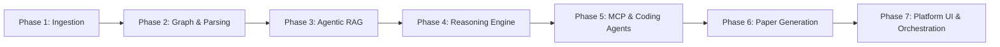

# Development Roadmap & Implementation Plan

> **Phased development milestones for building Research Copilot**

This roadmap details the implementation breakdown across 7 distinct engineering phases, ensuring a modular and scalable build.

 

---

## 🎯 Implementation Phases Overview

 

---

## 📋 Detailed Phase Breakdown

### Phase 1: Data Collection & Ingestion Layer
- [ ] Implement `BaseSourceClient` abstract interface.
- [ ] Build 8 scientific source connectors:
  - [ ] arXiv API Client
  - [ ] Papers with Code Client
  - [ ] Hugging Face Hub Client
  - [ ] Kaggle API Client
  - [ ] OpenAlex API Client
  - [ ] Semantic Scholar Client
  - [ ] Crossref API Client
  - [ ] PubMed / Entrez Client
- [ ] Define normalized schemas: `Paper`, `Dataset`, `CodeRepo`, `Benchmark`, `Author`.

 

### Phase 2: Document Processing & Knowledge Graph
- [ ] Build section-aware PDF parser and LaTeX text extractor.
- [ ] Implement scientific entity extraction (Models, Datasets, Metrics, Hyperparameters).
- [ ] Implement Knowledge Graph storage engine linking papers $\leftrightarrow$ authors $\leftrightarrow$ code $\leftrightarrow$ benchmarks.

 

### Phase 3: Agentic RAG Pipeline
- [ ] Build hybrid retrieval service (Dense Vector Search + Sparse BM25).
- [ ] Integrate cross-encoder re-ranking service for relevancy scoring.
- [ ] Implement multi-hop graph retrieval for contextual synthesis.

 

### Phase 4: Research Reasoning Engine
- [ ] Build literature summarizer & related work discovery engine.
- [ ] Build research gap detection module.
- [ ] Implement hypothesis and novel research idea generator.
- [ ] Build experiment plan generator (compute budget, metric targets, dataset splits).

 

### Phase 5: MCP Skill Router & Code Execution Subsystem
- [ ] Build MCP (Model Context Protocol) tool router.
- [ ] Implement containerized sandboxed execution environment.
- [ ] Integrate adapters for AI coding agents (**Claude Code**, **OpenAI Codex**, **OpenCode**).
- [ ] Implement standard experiment runner (download, reproduce, modify, train, evaluate, compare).

 

### Phase 6: Paper Generation Engine
- [ ] Build structured LaTeX generator for 8 paper sections (*Abstract* to *Conclusion*).
- [ ] Build DOI / arXiv citation verification engine (zero-hallucination guarantee).
- [ ] Implement automated table and benchmark figure compiler.

 

### Phase 7: Platform Orchestration & User Interface
- [ ] Build master `ResearchOrchestrator` service.
- [ ] Build interactive web interface for session management, execution monitoring, and manuscript editing.
- [ ] Perform end-to-end evaluation runs.
