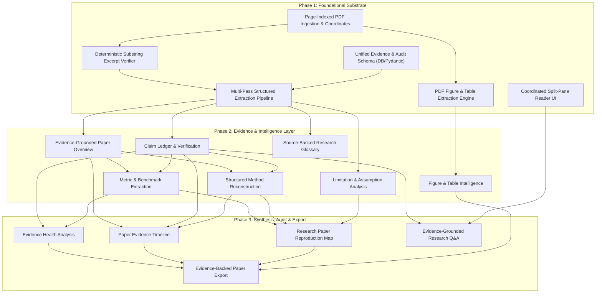

# Trace Evidence Studio Integration Roadmap for Research-Copilot

This document outlines the architectural prerequisites, foundational systems, and feature modules required to integrate the **Trace Research Paper Studio** evidence-grounded capabilities into **Research-Copilot**.

---

## 1. Foundational Prerequisites (Must Be Implemented Before Features)

The 12 evidence-grounded studio features cannot operate reliably on raw text summaries alone. They require a rigorous, deterministic document ingestion, verification, and visual grounding substrate.

### Page-Indexed PDF Ingestion & Coordinate Engine
Research-Copilot parses PDF documents into page-indexed data structures preserving page numbers, raw text blocks, reading order, and bounding-box coordinates, providing the deterministic reference layer needed for page-level citations and visual overlays.

### Deterministic Substring Excerpt Verifier & Locator
Research-Copilot scans LLM-extracted excerpts against the normalized text of the target page using exact and fuzzy substring matching, mathematically verifying quote authenticity and flagging hallucinated or misattributed text before it reaches the user.

### PDF Figure & Table Visual Extraction Engine
Research-Copilot identifies, crops, and extracts diagrams, architectures, plots, and tables directly from the original PDF vector streams as embedded image assets, pairing each visual asset with its original caption and page coordinates.

### Unified Evidence & Audit Schema (Pydantic & SQLite)
Research-Copilot establishes database tables and validation schemas for claims, sources, metrics, glossary terms, limitations, figures, and human review states, enabling persistent storage and querying across research workspaces.

### Multi-Pass Structured Extraction Pipeline
Research-Copilot decomposes paper analysis into focused, schema-enforced LLM extraction stages (overview & claims, methodology & metrics, assumptions & glossary, narrative timeline) to maximize precision and avoid token-window context truncation.

### Coordinated Split-Pane Evidence Reader UI
Research-Copilot provides an interactive reader interface linking evidence cards, claim badges, and metric chips on the left pane with the embedded PDF viewer on the right pane, supporting instant jump-to-page and excerpt highlighting.

---

## 2. Core Trace Evidence Features

### Evidence-Grounded Paper Overview
Research-Copilot generates a structured paper overview containing the core thesis, research questions and answers, key findings, and plain-language summary, with each insight traceable to the source paper.

### Claim Ledger & Verification
Research-Copilot decomposes papers into atomic claims, classifies their type, links them to exact excerpts and page locations, and tracks whether each claim has been verified.

### Evidence Health Analysis
Research-Copilot evaluates the strength of a paper's extracted evidence by measuring verified claims, page coverage, unverified excerpts, and weakly supported sections, highlighting areas that require further review.

### Structured Method Reconstruction
Research-Copilot converts a paper's methodology into a structured experimental pipeline covering datasets, algorithms, baselines, experimental setup, and relevant configurations for easier reproduction and comparison.

### Metric & Benchmark Extraction
Research-Copilot extracts reported metrics into structured records containing values, units, benchmarks, context, and source locations, making results directly comparable across papers.

### Limitation & Assumption Analysis
Research-Copilot separates author-stated limitations from detected constraints and assumptions, connecting them to the paper's evidence and existing research-gap analysis.

### Source-Backed Research Glossary
Research-Copilot automatically builds a paper-specific glossary of technical terms, acronyms, and concepts, with definitions linked back to their original source context.

### Figure & Table Intelligence
Research-Copilot extracts meaningful information from paper figures, tables, diagrams, and mathematical content, linking visual evidence back to the claims, methods, and metrics they support.

### Evidence-Grounded Research Q&A
Research-Copilot answers questions using verified claims and source excerpts, returning the supporting evidence and page location instead of generating unsupported answers.

### Paper Evidence Timeline
Research-Copilot reconstructs how a paper moves from research question → method → experiment → result → conclusion, giving researchers a traceable narrative of how the paper reaches its conclusions.

### Research Paper Reproduction Map
Research-Copilot converts extracted methods, datasets, metrics, and configurations into a structured reproduction checklist showing what is available, missing, or ambiguous for reproducing the study.

### Evidence-Backed Paper Export
Research-Copilot exports a structured research dossier containing the paper analysis, claims, evidence, metrics, methods, limitations, and citations so the analysis remains useful outside the application.

---

## 3. Implementation Sequence & Dependency Graph

