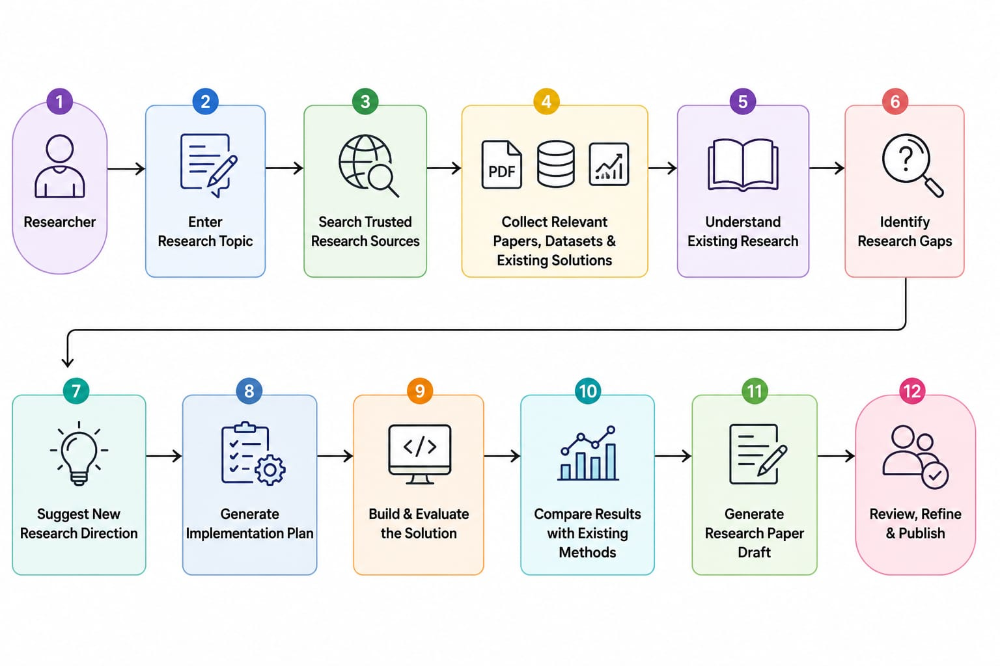

# Research Lifecycle & Workflow

> **The 12-Stage Scientific Workflow of Research Copilot**

Research Copilot guides researchers through a 12-stage scientific workflow, bridging literature discovery, code execution, and manuscript generation while keeping the human researcher in control.

 

---

## 🔄 12-Stage Lifecycle Overview

 

---

## 📑 Detailed Stage Descriptions

### Stage 1: Researcher Initiation
The human researcher initiates a research session with specific domain goals, target research questions, or compute constraints.

 

### Stage 2: Topic Specification
The researcher defines the topic or problem domain (e.g., *"Improving parameter efficiency in Vision-Language Models for medical imaging"*).

 

### Stage 3: Multi-Source Literature Search
The platform queries 8 primary scientific data repositories (arXiv, Papers with Code, Hugging Face, OpenAlex, Semantic Scholar, Crossref, PubMed, Kaggle) in parallel.

 

### Stage 4: Artifact Ingestion & Unification
Raw PDFs, LaTeX sources, source repositories, datasets, and benchmark tables are retrieved, normalized, and stored in the unified research data store.

 

### Stage 5: Literature Understanding & Knowledge Graphing
The Agentic RAG engine chunks, embeds, and constructs a Knowledge Graph connecting papers, code implementations, datasets, and evaluation metrics.

 

### Stage 6: Research Gap Identification
The reasoning engine analyzes limitations in existing literature, identifying unaddressed edge cases, compute bottlenecks, or missing benchmark comparisons.

 

### Stage 7: Novel Idea & Hypothesis Generation
Based on identified gaps, Research Copilot proposes actionable novel research directions and hypotheses to test.

 

### Stage 8: Implementation Planning
Generates a concrete, step-by-step engineering plan detailing:
* Dataset requirements & preprocessing steps.
* Model modifications / architectural changes.
* Training configuration & hyperparameter search space.
* Compute budget & hardware constraints.

 

### Stage 9: Build & Evaluate Solution
The MCP Skill Router delegates code execution tasks to AI coding agents (Claude Code, OpenAI Codex, OpenCode).
Agents execute dataset setup, paper reproduction, code modification, training runs, and evaluation scripts in a containerized environment.

 

### Stage 10: SOTA Benchmark Comparison
Empirical results from Stage 9 are benchmarked against existing state-of-the-art methods in the knowledge base, generating comparison tables and performance graphs.

 

### Stage 11: Structured Paper Draft Generation
Synthesis models (Gemini / Grok) generate a publication-ready LaTeX paper draft across all 8 standard sections (*Abstract, Introduction, Related Work, Methodology, Experiments, Results, Discussion, Conclusion*).
Citations are strictly ground-checked against retrieved source DOIs/arXiv IDs.

 

### Stage 12: Human Review & Refinement
The researcher reviews empirical evidence, modifies LaTeX drafts, adjusts experimental parameters, and approves the final manuscript for publication.
