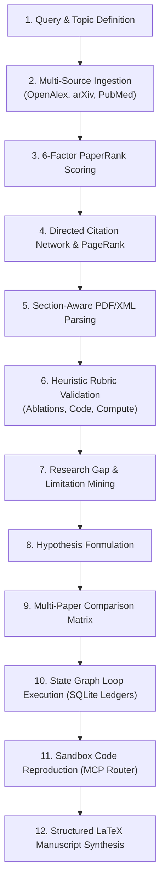

# Research Engineering Workflow

This document outlines the **12-Stage Research Engineering Process** executed by Research Copilot.

---

## 🔬 Stage Descriptions

1. **Query & Topic Definition**: Formulates scientific scope with natural language or scientific queries (`POST /api/v1/rank`).
2. **Multi-Source Ingestion**: Aggregates candidate works across OpenAlex and arXiv (`src/engines/access_resolver.py`).
3. **PaperRank Prioritization**: Computes transparent weighted scores across relevance, citations, graph prestige, velocity, rigor, and reproducibility.
4. **Citation Graph Analysis**: NetworkX builds directed citation subgraphs and calculates PageRank prestige.
5. **Section Extraction**: PyMuPDF & BeautifulSoup segment papers into `Introduction`, `Methods`, `Results`, `Limitations`.
6. **Heuristic Rubric Validation**: Automatically verifies presence of ablation tables, baseline comparisons, public GitHub links, and hardware budgets.
7. **Research Gap Mining**: Extracts stated limitations from published literature.
8. **Hypothesis Formulation**: Proposes testable novel research directions (`POST /api/v1/hypothesis/generate`).
9. **Multi-Paper Comparison**: Generates side-by-side matrices comparing methodology and rigor (`POST /api/v1/papers/compare`).
10. **State Graph Loop**: Iterative state machine persisting snapshots and artifact ledgers into SQLite (`POST /api/v1/graph/run`).
11. **Sandbox Reproduction**: Offloads compute and execution tasks to external coding agents via MCP.
12. **Manuscript Synthesis**: Produces structured Markdown synthesis briefs and publication-ready LaTeX section drafts.
